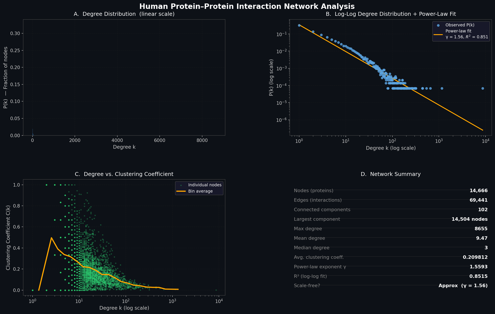
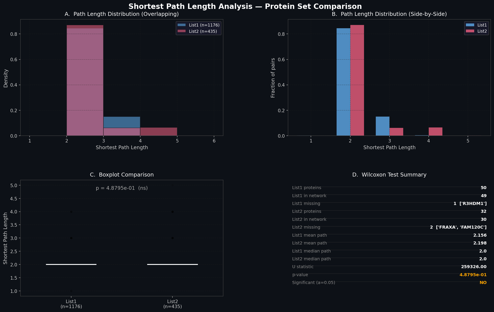

# Human Protein-Protein Interaction Network Analysis


Analyzes the topology of the human protein-protein interaction (PPI) network —
whether it's "scale-free," how tightly proteins cluster locally — and tests whether
two different protein sets occupy statistically different positions within it.

## Overview

Cells are organized as networks of interacting proteins. This project asks two
questions about that network structure:

1. **Global topology** — does the human PPI network have the hub-dominated,
   scale-free structure typical of many biological networks, and how locally
   clustered ("modular") is it?
2. **Comparative positioning** — do two given sets of proteins sit in similarly
   "central" or "peripheral" parts of the network, or are they measurably different?

**Part 1 — Network topology** builds an undirected graph from ~69,000 human protein
interactions, computes the degree and clustering coefficient of every protein, and
fits a power law to the degree distribution to test for scale-free structure.

**Part 2 — Comparative network position** computes all pairwise shortest-path
lengths within two separate protein lists, then uses a Wilcoxon rank-sum
(Mann-Whitney U) test to check whether the two sets differ in how "spread out" they
are across the network.

## Results

**Part 1:**

| Metric | Value |
|---|---:|
| Nodes (proteins) | 14,666 |
| Edges (interactions) | 69,441 |
| Connected components | 102 |
| Largest component | 14,504 nodes |
| Average degree | 9.47 |
| Average clustering coefficient | 0.2098 |
| Power-law exponent (γ) | 1.56 (R² = 0.851) |



The degree distribution follows an approximate power law (γ ≈ 1.56) — below the
canonical 2–3 range for strictly scale-free networks, plausibly because curated PPI
databases over-represent well-studied hub proteins, but still showing the
long-tailed, hub-dominated shape typical of biological networks. An average
clustering coefficient of ~0.21 indicates proteins form moderately tight local
neighborhoods, consistent with functional modules like signaling pathways and
complexes rather than random interaction.

**Part 2:**

Pairwise shortest paths were computed within each protein list (1,176 pairs for
List 1, 435 for List 2); a handful of proteins in each list weren't found in the
network and were excluded.



| | List 1 | List 2 |
|---|---:|---:|
| Mean shortest path | 2.156 | 2.198 |
| Median shortest path | 2.0 | 2.0 |

Wilcoxon rank-sum test: **p = 0.488** — no significant difference (α = 0.05). Both
protein sets sit similarly "close" to one another within the network (a "small
world" property), with no evidence that one set is more centrally positioned than
the other. Full interpretation is in
[`results/biological_interpretation.txt`](results/biological_interpretation.txt).

## Project structure

```
.
├── data/
│   ├── Human-PPI.txt              # Edge list of the human PPI network
│   ├── protein-list1.txt          # Protein set 1 (50 proteins)
│   └── protein-list2.txt          # Protein set 2 (32 proteins)
├── src/
│   ├── part1_network_analysis.py  # Degree, clustering, scale-free test
│   └── part2_shortest_paths.py    # Shortest paths + Wilcoxon test
├── results/
│   ├── part1_network_analysis/
│   │   ├── node_degrees.csv
│   │   ├── node_clustering.csv
│   │   ├── network_summary.txt
│   │   └── part1_network_analysis.png
│   ├── part2_shortest_paths/
│   │   ├── shortest_paths_list1.csv
│   │   ├── shortest_paths_list2.csv
│   │   ├── wilcoxon_test_result.txt
│   │   └── part2_shortest_paths.png
│   └── biological_interpretation.txt
├── requirements.txt
└── LICENSE
```

## Getting started

```bash
git clone https://github.com/<your-username>/ppi-network-analysis.git
cd ppi-network-analysis
pip install -r requirements.txt

python src/part1_network_analysis.py
python src/part2_shortest_paths.py
```

Both scripts read from `data/` and write their results into `results/` by default.

## Tech stack

- Python (networkx, pandas, numpy, scipy, matplotlib)

## License

This project is licensed under the [MIT License](LICENSE).
